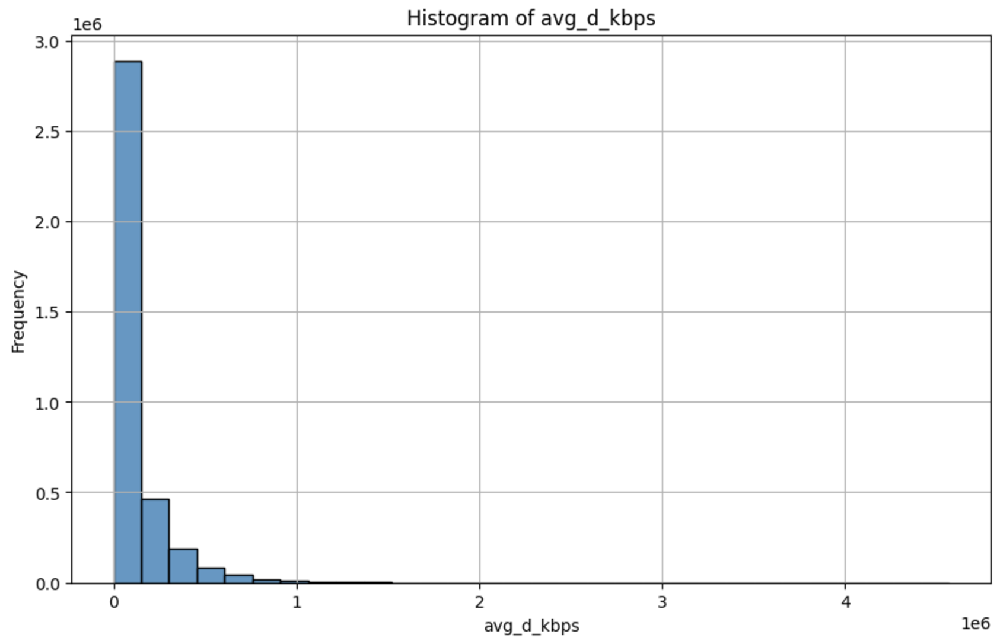
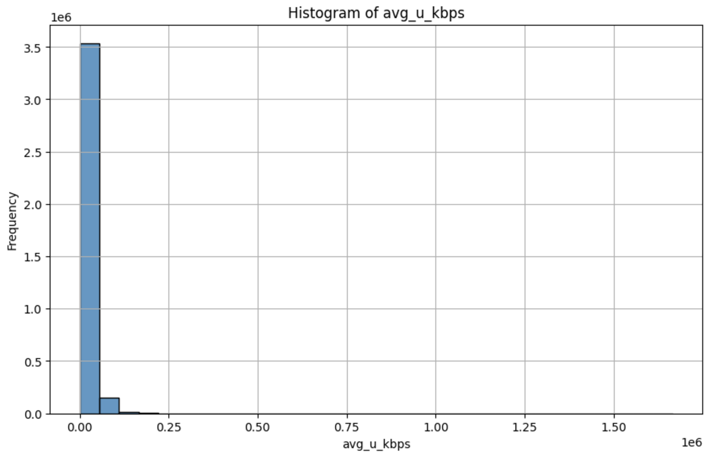
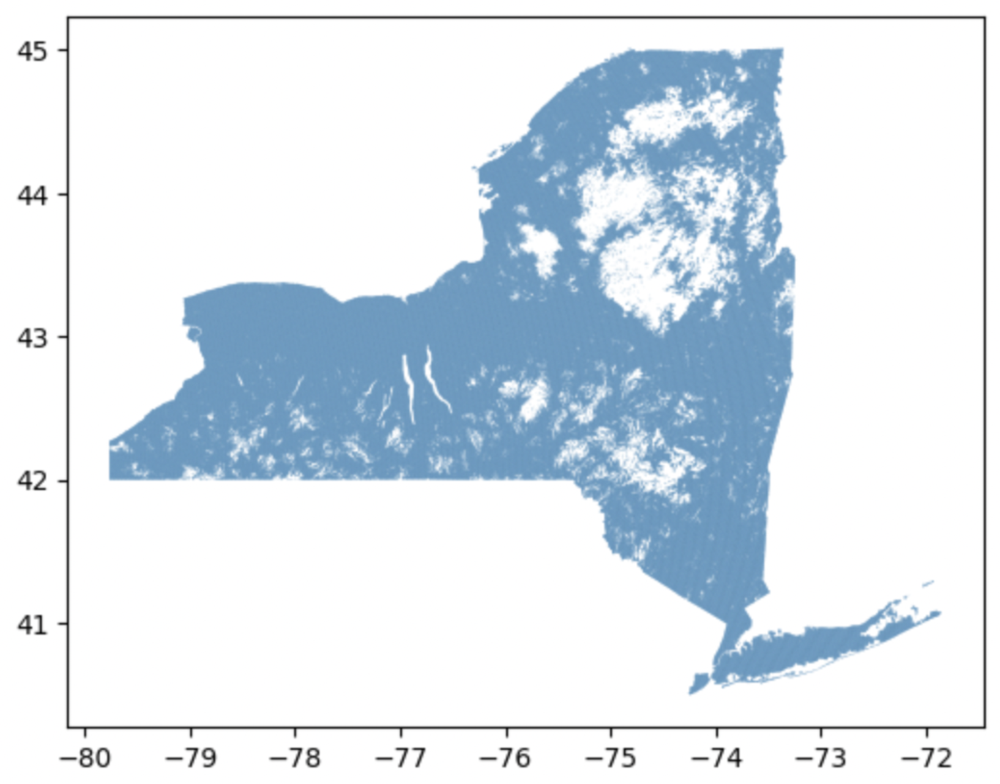
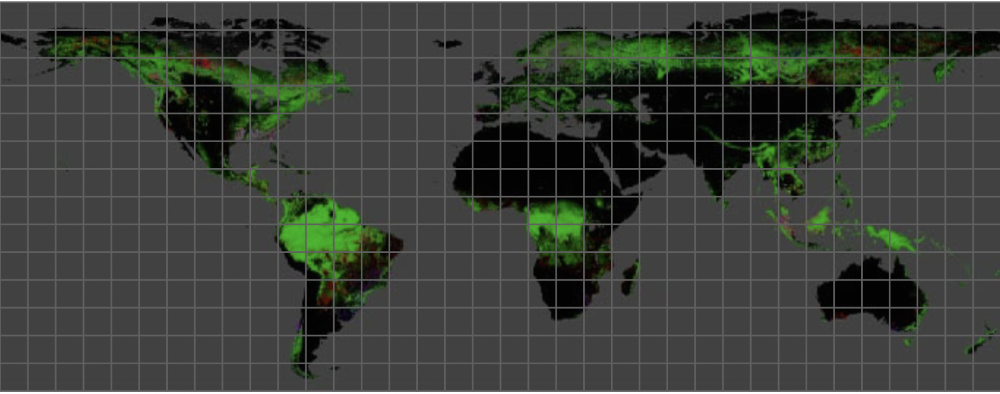
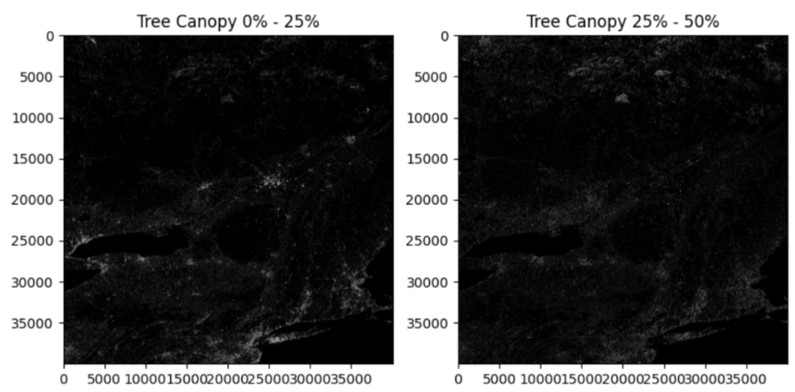
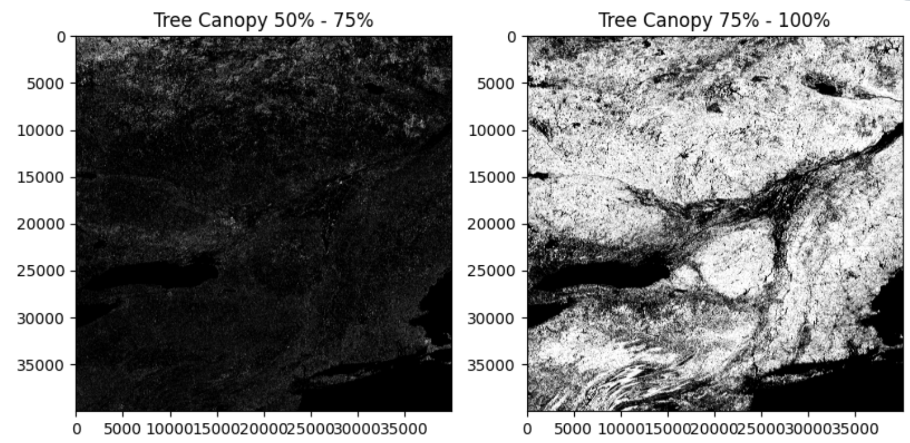

# Foliage

Computer vision model predicting the impact of foliage on service quality.

<!--
Project repo instructions
https://lms.ecornell.com/courses/1788003/pages/step-1-ensure-your-project-repo-is-complete-by-dec-8th-team-to-do

Project README instructions
https://lms.ecornell.com/courses/1788003/pages/step-2-ensure-your-project-readme-is-complete-by-dec-8th-team-to-do
-->

## Table of Contents

| Section |
| --- |
| [Project Overview](#project-overview) |
| [Objectives and Goals](#objectives-and-goals) |
| [Methodology](#methodology) |
| [Results and Key Findings](#results-and-key-findings) |
| [Visualizations](#visualizations) |
| [Potential Next Steps](#potential-next-steps) |
| [Sample Datasets](#sample-datasets) |
| [Colab Notebooks](#colab-notebooks) |
| [Installation Instructions](#installation-instructions) |
| [License](#license) |
| [Credits and Acknowledgments](#credits-and-acknowledgments) |
| [Individual Contributions](#individual-contributions) |

## Project Overview

As part of Break Through Tech AI's Fall 2024 AI Studio program, Verizon challenged us to build a computer vision model that uses aerial images to predict how foliage affects wireless network connections across the United States.

## Objectives and Goals

To provide actionable insights for Verizon network teams to diagnose connectivity issues, which they can use to optimize resource allocation and infrastructure planning.

## Methodology

Our project was unique in the sense that we weren't provided datsets due to privacy reasons and instead had to look for them outselves. So our first step was to source two types of datasets: one for aerial imagery and one for network performance.

After finding both types of datasets, we worked on Exploratory Data Analysis (creating visualizations, cleaning the data, etc). Because our datasets came from different sources, we had to cross reference them to ensure that the locations of the images and foliage matched up.

The last step is to train the CV model to estimate likely impact of foliage on propagation on a 0-1 scale (o for not at all dense, 1 for to extremely dense). For testing, we planned to split our combined dataset into train, test, and validation to ensure our model generalized well enough for business applications.

## Results and Key Findings

While performing Exploratory Data Analysis on our datasets, network data tended to be skewed to the right, indicating that most network speeds seemed to be decently fast while a few were slow. We also found that there was a lot of variability in foliage depending on the geographic location and the season. For example, if foliage peaked in spring and summer then that would lead to a reduced network quality.

These observations added to the complexity of our project since they caused issues with potential dependencies: how can we find and cross reference datasets that were consistent with another? How do we solve for seasonality? Are there parts of the country where seasons are more relevant than others?

To tackle these issues, we attempted to to focus on New York Data only. But given our time constraints, it was difficult to find relevant datasets that were sufficently large to train a computer vision model. Additioanlly, it was challenging to cross reference the satellite and network data.

Our team decided to pivot to a second project related to AutoBI in the middle of fall due to the large scale of this one. You can take a look at that GitHub repo and deployed project here: https://github.com/am2558/verizon-sql-autobi/tree/main.

## Visualizations

### Ookla Network Data

  
   

### Federal Communications Commission (FCC) Network Data

  

### Landsat Imagery

  
  
  

## Potential Next Steps

Although we were under a time crunch and didn't complete as much as we would have liked for this project, we had some ideas for next steps if we were on a less restrictive timeline. We would've looked for additional datasets for both satellite imageery and network speed data, first focusing on New York but eventually expanding to across the country. After the buildling the model, we would deploy it and integrate it into an interactive tool for humans to provide feedback on model outputs and use RLHF (Reinforcement Learning with Human Feedback) to improve the model further.

## Sample Datasets

Global Landsat Imagery Data  
https://storage.googleapis.com/earthenginepartners-hansen/GFC-2023-v1.11/download.html

FCC Network Data  
Availability Data As Of: Jun 30, 2024 (latest), Provider Name: Verizon  
https://broadbandmap.fcc.gov/data-download/data-by-provider

Ookla Network Data  
2024 quarter 2 mobile performance  
https://github.com/teamookla/ookla-open-data/tree/master

## Colab Notebooks

Our notebooks are all located in this repository and have a `.ipynb` extension.

## Installation Instructions

You will need to have [PROJ](https://proj.org/en/9.5/) installed on your machine to use geopandas.  
[Homebrew](https://formulae.brew.sh/formula/proj) Installation for macOS: `brew install proj`  
[Other OS installation instructions](https://proj.org/en/9.5/install.html)

You will also need to install Python and the following libraries: matplotlib, numpy, seaborn, scipy.

Run the cells in any one of our notebooks in this repository to run our code.

## License

Apache License 2.0

## Credits and Acknowledgments

Team Members: Adya Mohanty, Hridia Tanha, Katherine Chang Wu, Kiran Mitra, Vivian Liu  
Verizon Challenge Advisors: Arthur Lusty, Arun Vonoz, Michael Hanson, Priyanka Giglio  
TA: Yu-Chi (Kade) Lin

## Individual Contributions

Adya Mohanty (`Land_Coverage_EDA.ipynb`): Explored ways to cross reference datasets following Kade's (our TA) example (`Kade_dataset_matching.ipynb`).

Vivian Liu (`Vivian_Data_Exploration.ipynb`): Performed Exploratory data analysis on various network performance datasets and created visualizations. Explored landsat datasets and tried ways to cross reference datasets following Kade's example. Wrote README.

Kiran Mitra (`gls-preliminary-eda.ipynb`): Created tile visualizations for landsat imagery.
